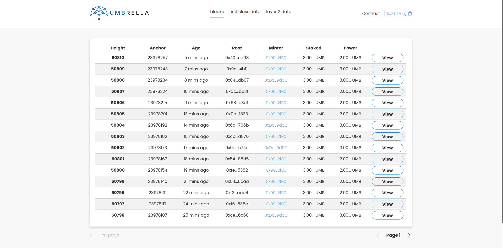
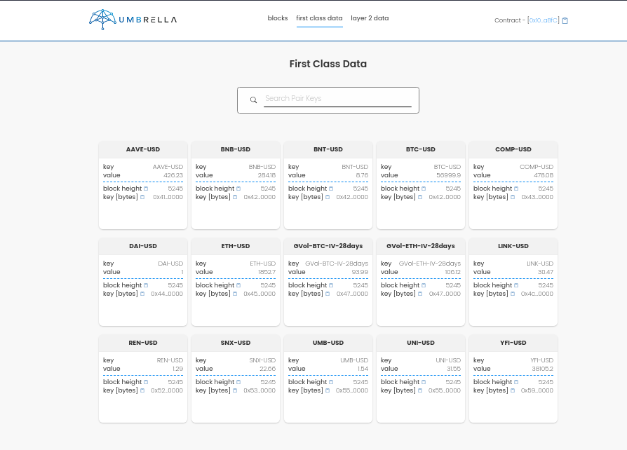
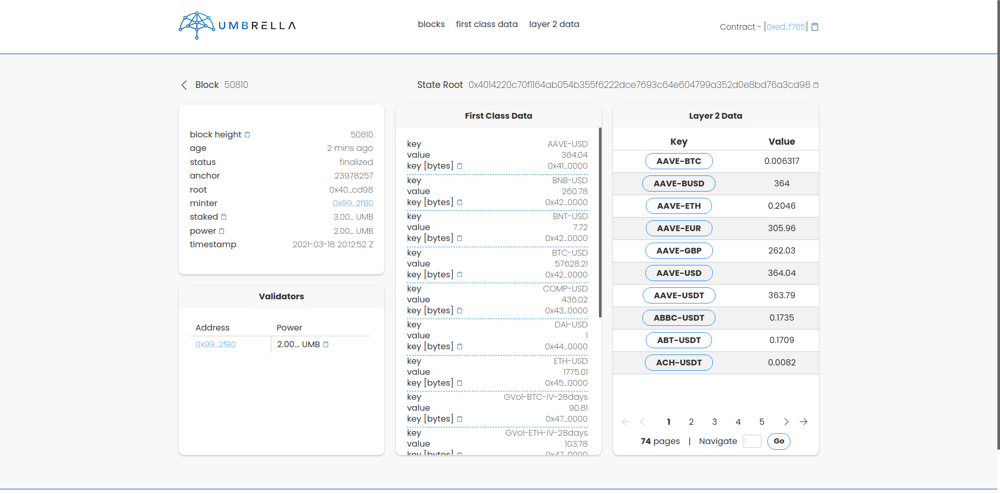
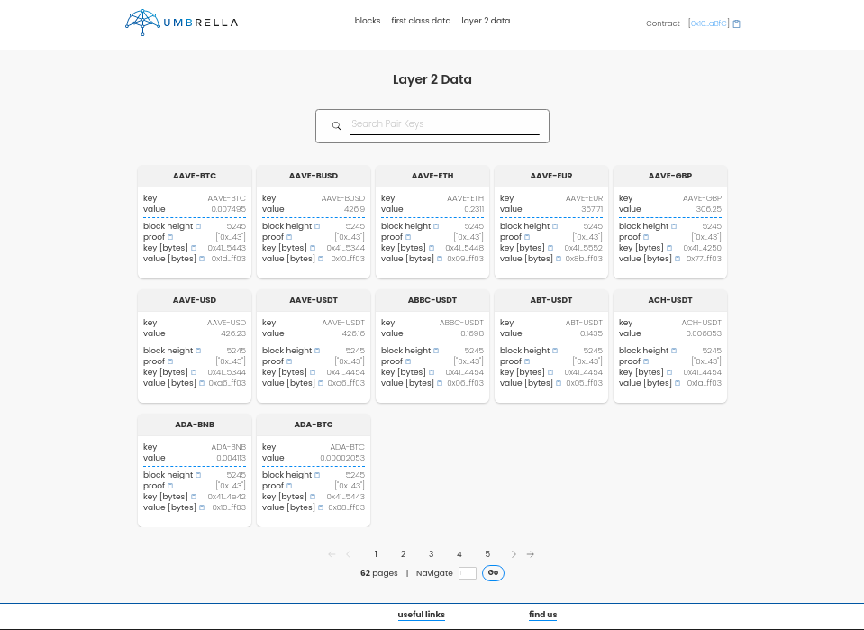
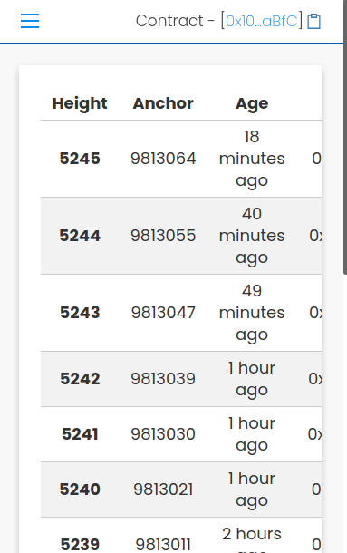
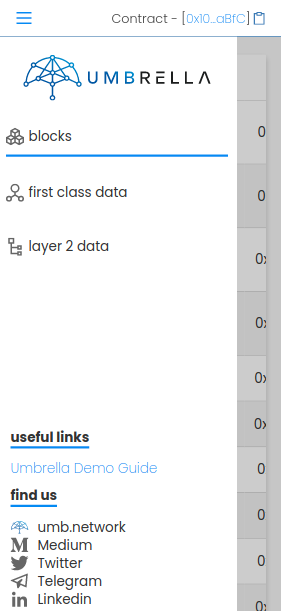

<p align="center">
  
</p>

# Taurus - Block Explorer

## Description

Taurus provides easy navigation through Umbrella's side-chain, allowing users to access blocks data such as leaves and Merkle proofs.

## Setup

```sh
$ cp .env-example .env
```

Fill in `.env` with the required environment variables:

```
AWS_REPOSITORY=
REACT_APP_BLOCKS_API=       //The URL in which the API will be available
REACT_APP_SCAN_URL=         //URL for the address scan
REACT_APP_TOKEN_AUTH=       //Auth Token to be used
REACT_APP_CHAIN_CONTRACT=   //Chain contract address
REACT_APP_SHOULD_FALLBACK=  //Whether should mock requests. ex: true
```

## Running

At the root of the folder:

```sh
$ yarn install

$ yarn start
```

or, if you're using npm:

```sh
$ npm install

$ npm start
```

You can also run it using docker:

```sh
$ docker-compose up
```

Note: If you're running everything locally, setup both Block Explorer and API (sanctuary) and make sure explorer points to the correct API.

## Deploy

### Production

Deployment is automatically handled through CI/CD by setting `prod` TAG to a commit.

### Development

Deployment needs to be done locally. You'll need to set correctly the AWS repository in `.env`, and then run:

```sh
make dev
```

or, if you're using a M1 Macbook:

```sh
make dev-m1
```

## Previews

### Web



---



---



---



---

### Mobile

<p align="center">
  
  
</p>

---
